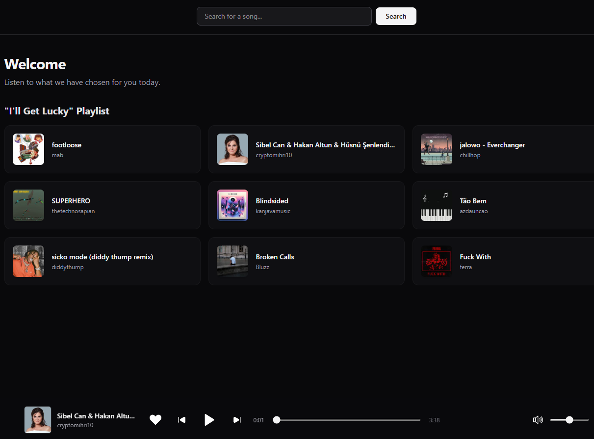
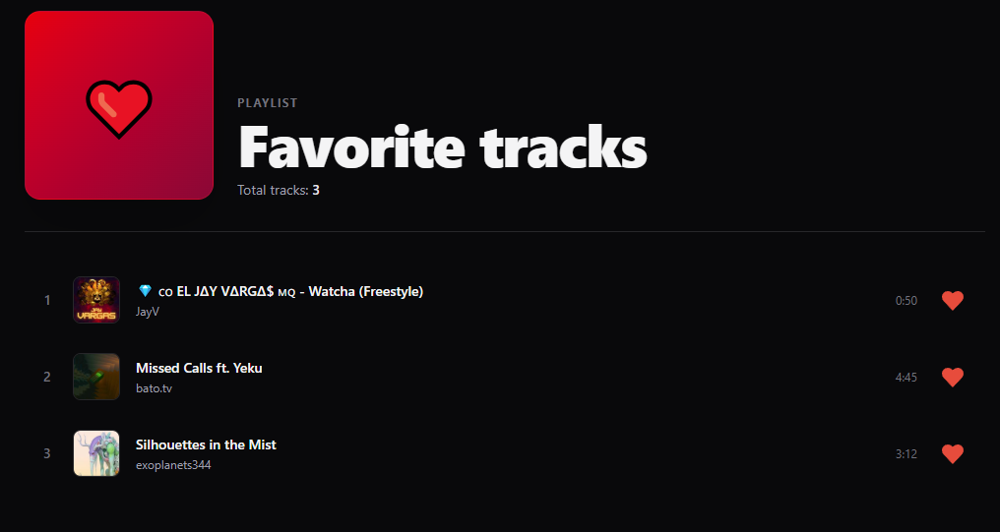

# Music Player


[Description](#description) • [Features](#features) • [Installation](#installation) • [Screenshots](#screenshots)

## Description

A responsive music streaming SPA built on top of the decentralized
Audius API. The core is a custom audio layer that survives page
transitions, manages a persistent play queue, and syncs user data
(favorites, history) to localStorage.

The project focuses on three things: component-driven UI architecture,
isolating complex state through custom hooks, and safe async data
handling (request cancellation, debouncing, race-condition guards).

## Features

**Data & API**

- Live track and playlist data from Audius nodes
- Search with debounced autocomplete and AbortController-based
  request discarding

**Playback**

- Global audio element kept alive across routes
- Queue system with absolute indexing and auto-advance

**UX**

- Persistent favorites synced with localStorage
- URL-driven routing for tracks, artists, and app states

## Installation

Clone the repository

```bash
git clone https://github.com/Woefulking/Music-Player.git
cd Music-Player
```

Install dependencies

```bash
npm install
```

Run the project

```bash
npm run dev
```

## Screenshots





